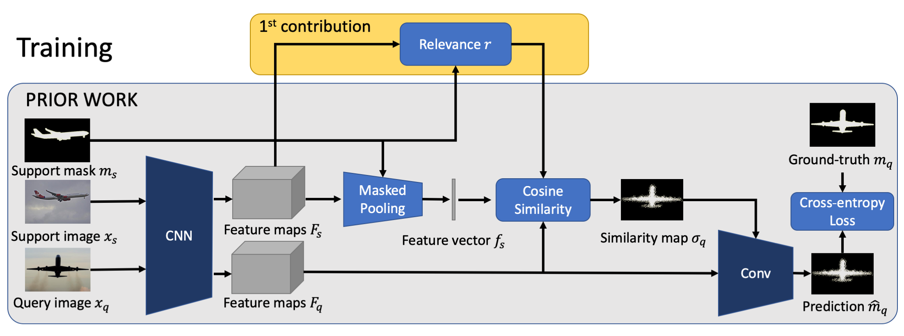

# Feature Weighting and Boosting for Few-shot Segmentation

## Introduction
This is the officially unofficial implementation of the paper "Feature Weighting and Boosting for Few-Shot Segmentation" https://arxiv.org/abs/1909.13140 accepted to [ ICCV 2019](https://openaccess.thecvf.com/content_ICCV_2019/papers/Nguyen_Feature_Weighting_and_Boosting_for_Few-Shot_Segmentation_ICCV_2019_paper.pdf)




This paper is about few-shot segmentation of foreground objects in images. We train a CNN on small subsets of training images, each mimicking the few-shot setting. In each subset, one image serves as the query and the other(s) as support image(s) with ground-truth segmentation. The CNN first extracts feature maps from the query and support images. Then, a class feature vector is computed as an average of the support's feature maps over the known foreground. Finally, the target object is segmented in the query image by using a cosine similarity between the class feature vector and the query's feature map. We make two contributions by: (1) Improving discriminativeness of features so their activations are high on the foreground and low elsewhere; and (2) Boosting inference with an ensemble of experts guided with the gradient of loss incurred when segmenting the support images in testing. Our evaluations on the PASCAL-5i and COCO-20i datasets demonstrate that we significantly outperform existing approaches.

This repo is adapted from: https://github.com/chenxi116/DeepLabv3.pytorch 
and adopted some dataset generation codes for PASCAL-5i from https://github.com/xiaomengyc/SG-One


## Installation
```bash
pip install -r requirements.txt
```

and follow the instruction from [./datasets/README.md](./datasets/README.md) to download and setup the datasets including VOC2012 and COCO2017


## Training and Testing

The central file of our project is [./main_official.py](./main_official.py), please read the arguments part Line 32-92 to understand which options it supports.


(Optional) The training process is recorded in tensorboardX format, to read it, you can download and install tensorflow (cpu version is fine) and read it by using the command

```tensorboad --logdir=logs/[logging_folder]```

Some examples training scripts and evaluating scripts are provided in [./train_official.sh](./train_official.sh) and [./eval_official.sh](./eval_official.sh)


Disclaimer: the results in this repo may not match the results reported in the paper (due to randomness) and this is not the full implementation of our original experiments.


If you have question, feel free to add an issue.


